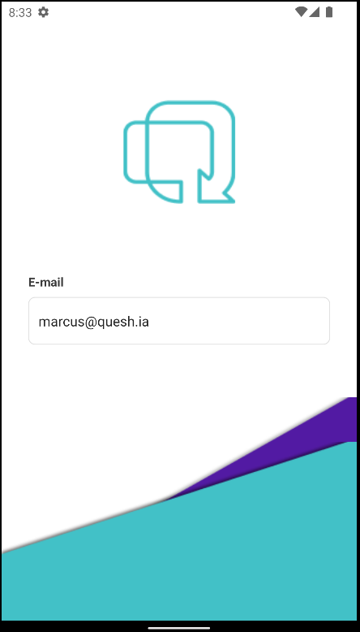
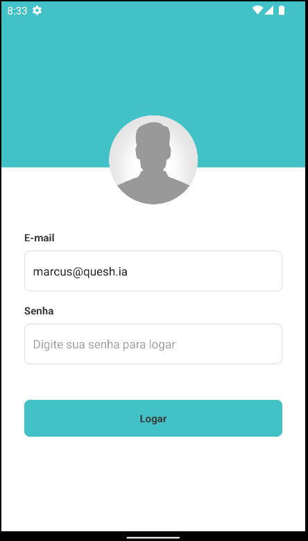
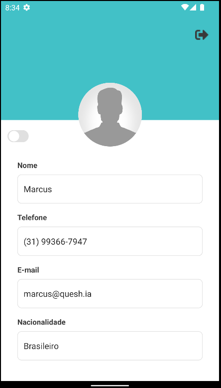
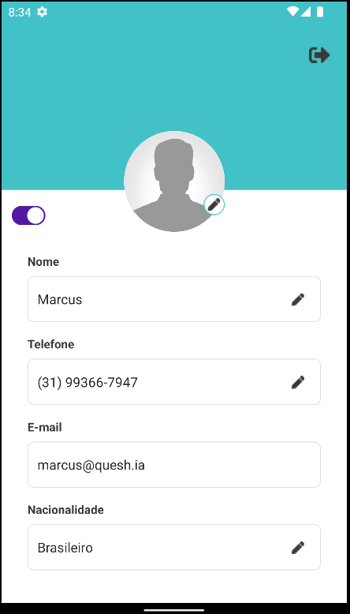
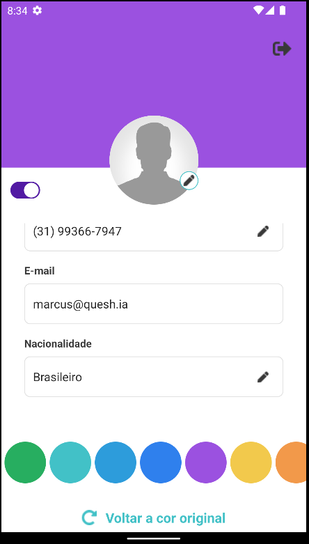

# Instruções do projeto
<p align="center">
  
</p>
<p align="center">	
   <a href="https://www.linkedin.com/in/marcusrodriguesdev">
      
   </a>
  
</p>

# ⭐ Sumário

* [Descrição](#descricão)
* [Demonstração da Aplicação](#demonstracao-da-aplicacao)
* [Meus Passos](#meus-passos)
* [Tecnologias](#Tecnologias)
* [Instruções de uso](#instruções-de-uso)
* [Como rodar o projeto](#como-rodar-o-projeto)
* [Achou algum bug?](#problema)
* [Licença](#licença)

# 💻 Descrição
Um aplicativo de criação perfil de usuário, que exibirá suas informações básicas e que podem ser editáveis posteriormente.


# 📱 Demonstração da Aplicação
<p align="center">
  
  
  
  
  
</p>

# 🚀 Meus Passos
 - Comecei instalando bibliotecas para manter boas práticas de desenvolvimento, como eslint, prettier, commitlint, entre outras.
 - Configurei o jest para testes unitários, garantindo 100% de cobertura para manter toda a qualidade na entrega final.
 - Consumi a API disponibilizada para obter os dados do usuário.
 - Criei os componentes, seguindo os padrões do projeto.
 - Criei as telas finais e fiz a integração com a API.

# 🛠 Tecnologias
As seguintes ferramentas foram usadas na construção do projeto:
* [React-Native](https://reactnative.dev/)
* [TypeScript](https://www.typescriptlang.org/)
* [Styled-components](https://styled-components.com/)
* [Jest](https://jestjs.io/pt-BR/)
* [Huskt](https://typicode.github.io/husky/#/)
* [Eslint](https://eslint.org/)
* [Prettier](https://prettier.io/)
* [Commitlint](https://commitlint.js.org/#/)

# 📥 Instruções de uso
Por problemas com a API será necessário utilizar dados mocados. Para fazer o login, você pode utilizar os seguintes dados:
```bash
email: marcus@quesh.ia

senha: 12345
```


# 🚀 Como rodar o projeto

```bash
# Clone este repositório
$ git clone git@github.com:marcusrodriguesdev/desafio-mobile.git

# Acesse a pasta do projeto no terminal/cmd
$ cd desafio-mobile/project

# Instale as dependências
$ yarn install
ou
$ npm install

# Execute a aplicação em modo de desenvolvimento
$ yarn start
ou
$ npm run start

## Ao mesmo tempo, execute o app no emulador ou no seu celular
$ yarn android
ou
$ npm run android

# O app será aberto na porta:8081 - acesse http://localhost:8081
```

# 🐛 Achou algum problema?
Se encontrar algum problema, por favor, crie uma issue [aqui](https://github.com/marcusrodriguesdev/desafio-mobile/issues/). Se você já encontrou a solução para o problema, **faça um pull request**!


# 📝 Licença
Desenvolvido com 💙 por [Marcus Rodrigues](https://www.linkedin.com/in/marcusrodriguesdev)